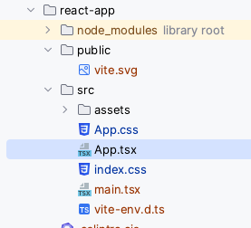

# Prima applicazione

// todo [DA AGGIORNARE](https://create-react-app.dev/docs/getting-started/)

Dopo aver [installato](./install.md) `create-react-app`:
```shell
create-react-app react-app
// aspettare perché il processo si concluda e quindi
cd react-app
npm run start
```
L'ultimo comando dovrebbe far partire un server ed aprire una connessione al nuovo sito usando
il browser predefinito e visualizzando il nuovo test.

Se guardiamo la cartella della applicazione appena creata dovremmo avere più o meno questa 
situazione




Il file principale con il componente root é il file App.js contenuto nella cartella `src`

```javascript
import logo from './logo.svg';
import './App.css';

function App() {
  return (
    <div className="App">
      <header className="App-header">
        
        <p>
          Edit <code>src/App.js</code> and save to reload.
        </p>
        <a
          className="App-link"
          href="https://reactjs.org"
          target="_blank"
          rel="noopener noreferrer"
        >
          Learn React
        </a>
      </header>
    </div>
  );
}

export default App;

```


